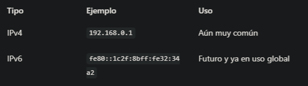
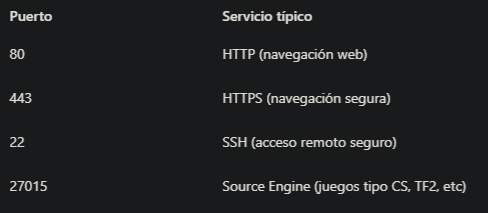
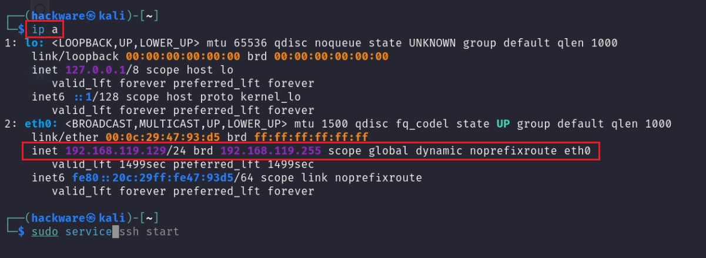
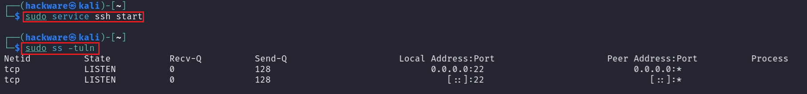

# Módulo 1 -- Fundamentos de hacking Ético

## 1.1 Introducción a redes. IP, puertos, protocolos, sockets

### 🎯 Objetivo
comprender cómo funciona una red a bajo nive: qué es una IP, qué papel tienen los puertos, cómo se comunican las máquinas, qué son los protocolos
y qué significa "abrir un socket".
Esta es la base de todo pentest qie involucre tráfico de datos, servidores, juegos online o incluso exploits locales.

## 🌐 1.1.1 ¿Qué es una red?
Una red es el conjunto de dispositivos que intercambian información entre sí. pueden ser:
- Locales (LAN): ej, dos PCs en una misma habitación
- Globales (WAN): ej. tú y un servidor se Steam en Canadá

Toda red digital necesita una dirección para cada nodo. Esa dirección es la IP (Internet Protocol).

## 🧮 1.1.2 IP: la dirección de cada máquina
Una dirección IP es como la dirección postal de un dispositivo. Hay dos formatos principales:



En pentesting, aprenderás a identificar IPs internas (privadas) y externas (públicas), para escanear objetivos o entender cómo se comunican los juegos.

## 🎯 IP privadas más comunes:
- 192.168.0.X

- 192.168.1.X

- 10.0.X.X

estas no salen a internet directamente. Son locales.
si ejecutas:
```bash
# Bloque de código en bash
ip a
```
(en kali) o
```
ipconfig
```
(en Windows), verás tu IP interna.

## 🔌 1.1.3 ¿Qué es un puerto?

cada IP tiene hasta 65.535 puertos disponibles. 
Un puerto es como una puerta de entrada a un servicio concreto.



Cuando un puerto se conecta a un servidor , lo hace a una IP y un puerto específico.

## 📦 1.1.4 Protocolos: reglas del juego
Un protocolo es un conjunto de reglas para comunicar datos. Los más comunes en pentesting:
- TCP: Fiable, requiere conexión (ej. web, correo)
- UDP: Rápido, sin garantía (ej. voz en tiempo real, videojuegos)

Ejemplo de cómo se ve:
```
192.168.0.15:80 → IP:Puerto usando TCP
```

## 🔧 1.1.5 ¿Qué es un socket?
Un **Socket** es una combinación de:
```
[IP] + [Puerto] + [Protocolo]
```

Sirve para abrir una conexión real entre dos puntos.
Ejemplo práctico en Python:
```
import socket

s = socket.socket(socket.AF_INET, socket.SOCK_STREAM)
s.connect(("example.com", 80))
```
Este código abre una conexión TCP a example.com por el puerto 80.

En el contexto de un videojuego, si un cliente se conecta a un servidor multijugador, se está abriendo un socket en segundo plano.

---

# 🧪 EJERCICIO 1: Ver tu IP y puertos abiertos
 En Kali:
 1. Ver tu IP:
 ```
ip a
```

2. Ver puertos abiertos:
Podemos iniciar el servivicio SSH
 ```
 sudo service ssh start
 sudo ss -tuln
```
- -t: TCP

- -u: UDP

- -l: listening (escuchando)

- -n: sin resolución de nombres


## Resolución

```
ip a
```
 [Vídeo Módulo 1 - ejercicio 1 Escucha de puertos TCP/UDP en Kali Linux](https://youtu.be/HgrcWt7UlTg)

 

este comando muestra todas las interfaces de red y sus configuraciones. Aquí 192.168.119.129
es la IP privada asignada a mi Kali. Será útil para escanear desde otras máquinas o establecer
conexiones


```
sudo ss -tuln
```
 

🔐 Aquí vemos que el puerto 22 (usado por SSH) está abierto en todas las interfaces.

🧠 Análisis
Este ejercicio sirve para:

- Entender si tu máquina ofrece servicios

- Detectar puertos potencialmente vulnerables en un pentest

- Tener claro cómo consultar IP y tráfico sin herramientas externas


 

## ✅ Checklist de la sección 1.1

- [ ] Comprendo qué es una red y para qué sirve una IP
 Comprendo qué es una red y para qué sirve una IP

 - [ ] Sé diferenciar IP privada de pública

 - [ ] Entiendo qué son los puertos y qué protocolos usa cada uno

 - [ ] Tengo claro qué es un socket y cómo se usa

 - [ ] He ejecutado ip a y netstat en Kali

