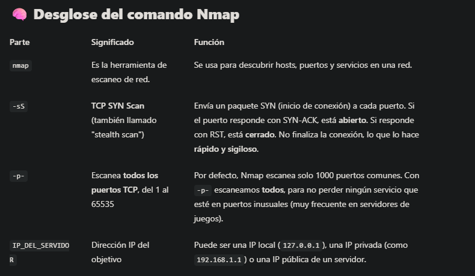
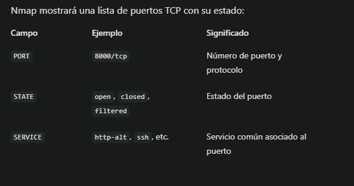
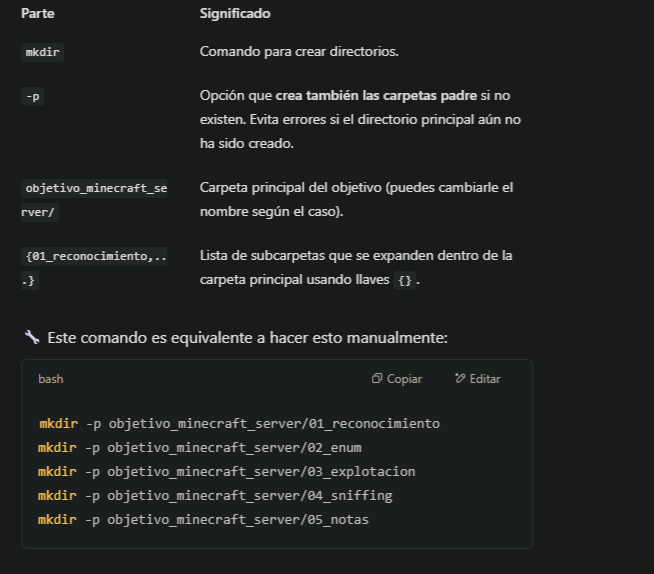
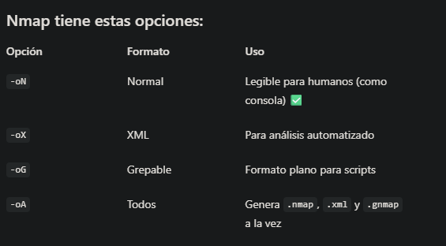

# ✅ Sección 1.2 – Redes, Puertos y Servicios
Bienvenido a la Sección 1.2 del curso de Pentesting de Videojuegos. Aquí seguimos construyendo sobre lo que ya aprendiste en la 1.1.
**Objetivo**: Comprender cómo los videojuegos utilizan redes, puertos y servicios, y qué oportunidades abre esto para la auditoría ética.

## 🔹 1. ¿Qué es un puerto y por qué importa?

 📘 Definición breve:

Un puerto es un número lógico que identifica un servicio específico en una máquina con IP. Cuando un juego se conecta a un servidor, lo hace a través de un puerto.

### 🕹 Ejemplo en videojuegos:

Un juego multijugador podría usar el puerto 27015 (muy usado por juegos de Valve como Counter-Strike).

Si ese puerto está abierto, un atacante podría intentar interactuar con él.

### 🎯 Conceptos clave:

Puerto abierto: el servicio está accesible.

Puerto cerrado: no hay servicio escuchando.

Puerto filtrado: hay un firewall o filtro bloqueando.

## 🔹 2. ¿Qué es un servicio y cómo se relaciona?

 📘 Servicio = Software que escucha en un puerto.
Ejemplos:

HTTP (web) escucha en el 80

SSH escucha en el 22

En juegos: un servicio propio del servidor que gestiona jugadores, partidas, etc.

💡 Algunos servicios de juegos pueden tener fallos.

## 🔹 3. Herramientas iniciales de escaneo

### 🛠 Nmap (el clásico):
```
nmap -sS -p- IP_DEL_SERVIDOR
```


🔎 ¿Qué resultados devuelve?

Nmap mostrará una lista de puertos TCP con su estado:


🎯 ¿Cuándo usarlo?
Este comando es ideal cuando:

No sabes en qué puertos escucha un servidor (por ejemplo, un juego personalizado).

Quieres un escaneo completo y no perderte servicios ocultos.

Estás en una auditoría inicial.


antes de continuar, vamos a establecer un flujo de trabajo base, para realizar nuestras auditorías, es muy importante tener todo bien organizado y accesible, para ello definiremos el siguiente workflow:

# 🗂️ FLUJO DE TRABAJO ORGANIZADO PARA PENTESTING

(Inspirado en buenas prácticas reales)

### 📁 1. Estructura base de carpetas
Creamos una carpeta por objetivo (por ejemplo, objetivo_minecraft_server), y dentro de ella, subcarpetas temáticas para cada fase del análisis:

```
objetivo_minecraft_server/
├── 01_reconocimiento/
│   ├── escaneo_puertos.txt
│   ├── escaneo_udp.txt
│   ├── puertos_abiertos.txt
│   └── servicios_detectados.txt
├── 02_enum/
│   ├── banners.txt
│   └── versiones_soft.txt
├── 03_explotacion/
│   ├── scripts/
│   └── credenciales.txt
├── 04_sniffing/
│   └── capturas.pcap
├── 05_notas/
│   └── resumen.md
```

### 📁 ¿Qué guarda cada carpeta?

```
| Carpeta                Contenido                                                                   
----------------------------------------------------------------------------- |
| 01_reconocimiento/   | Escaneos con Nmap (puertos, servicios), filtrado con grep.                  


| 02_enum/             | Enumeración activa de versiones, banners y posibles 
vulnerabilidades.      


| 03_explotacion/      | Scripts de explotación, contraseñas encontradas, notas de prueba.   


| 04_sniffing/         | Archivos `.pcap` de capturas de red, anotaciones asociadas.   


| 05_notas/            | Markdown con todo lo aprendido, útil como documentación final del análisis. 
```
## 🔧 Comando inicial para preparar entorno
Puedes tener un script base de preparación, o hacerlo a mano al inicio de cada análisis, de momento aprenderemos a crear nuestro entorno de trabajo a mano y más adelante lo automatizaremos mediante un script de Python.
para crear nuestra estructura de carpeta ejecutaremos el siguiente comando:

```
mkdir -p objetivo_minecraft_server/{01_reconocimiento,02_enum,03_explotacion,04_sniffing,05_notas}
cd objetivo_minecraft_server/01_reconocimiento

```
¿Qué hace?
Crea una carpeta llamada objetivo_minecraft_server y dentro de ella varias subcarpetas a la vez.

Partes del comando:



Y ya estás listo para comenzar el primer escaneo, cuando lancemos nuestro nmap, que podemos llamar por ejemplo; escaneo_puertos.txt este archivo se guardará en la carpeta donde nos encontremos, por ello antes delanzarlo, nos situraremos enla carpeta donde queremos guardarlo en este caso , en la carpeta 01_reconocimiento:

```
cd objetivo_minecraft_server/01_reconocimiento
```

```
nmap -sS -p- -T4 -v -oN escaneo_puertos.txt 127.0.0.1
```
📌 Consejo extra: Para asegurarte siempre de estar en la carpeta correcta antes de lanzar un escaneo:

```
pwd
```
Con Pwd se nos indica donde nos encontramos dentro del sistema.

# 🧪 EJERCICIO BASE – ESTRUCTURA DE ATAQUE + PRIMER ESCANEO

### 🎯 Objetivo: 

- Crear la estructura base de trabajo.

- Hacer un escaneo de puertos contra un objetivo real y autorizado.

- Guardar los resultados correctamente.

## 🔧 PASO A PASO

### ✅ PASO 1 – Crear la estructura de carpetas
lo primero será situarnos en nuestra carpeta de usaurio normal dentro del sistema Kali. nuestra carpeta de usuario es:
```
/home/tu_usuario/
```
Pero se accede de forma más directa usando el símbolo:
```
cd ~
```
O simplemente:
```
cd
```
Entonces primero la carpeta pentesting:
```
cd ~               # Ir a tu carpeta de usuario
mkdir pentesting   # Crear la carpeta base de trabajo
cd pentesting      # Entrar en ella
```
Una vez dentro de ella queremos consturir la siguiente estructura:

```
~/pentesting/scanme_nmap_org/
├── 01_reconocimiento/
├── 02_enum/
├── 03_explotacion/
├── 04_sniffing/
└── 05_notas/
```

Podemos crear estas carpetas de forma nanual dela siguiente manera:
```
## 🎥 Ejercicio 2 – Estructura de trabajo Pentesting en Kali Linux

En este ejercicio se muestra cómo crear la estructura de carpetas base que utilizaremos en todos los análisis del curso.  
Se enseña tanto la creación manual (paso a paso) como la versión optimizada en una sola línea.

🔗 **Vídeo complementario:**  
[Estructura de trabajo Pentesting Kali Linux básica](https://youtu.be/pW5RC3Lj0B8)
Este vídeo forma parte de la documentación visual del curso y está vinculado al contenido del Módulo 0 y la preparación previa al uso de herramientas como Nmap.

---

### ✅ Opción 1 – Creación manual (paso a paso)

```bash
cd ~
mkdir pentesting
cd pentesting
mkdir scanme_nmap_org
cd scanme_nmap_org
mkdir 01_reconocimiento
mkdir 02_enum
mkdir 03_explotacion
mkdir 04_sniffing
mkdir 05_notas

```
```

---

### ✅ Opción 2 – Creación automatizada (una sola línea)

mkdir -p ~/pentesting/scanme_nmap_org/{01_reconocimiento,02_enum,03_explotacion,04_sniffing,05_notas}
cd ~/pentesting/scanme_nmap_org/01_reconocimiento


```

### ✅ PASO 2 – Lanzar el escaneo de puertos

```
nmap -sS -p- -T4 -v -oN escaneo_puertos.txt scanme.nmap.org
```
📁 Resultado: el archivo escaneo_puertos.txt se guarda en 01_reconocimiento/.
recuerda:

- ***nmap***: Es la **herramienta de escaneo de red** descubre **puertos** y - **servicios** en una red o en la IP que vamos a escanear.

- ***-sS***: **TCP SYN Scan**. Envía un pquete SYN(inicio de conexión) a cada puerto. Si el puerto responde con SYN_ACK, está abierto. Si responde con RST, está cerrado. No finaliza la conexión, lo que lo hace rápido y sigiloso.

- ***-p-***: Escanea todos los puertos TCP, del 1 al 65535. Por defecto, Nmap escanea solo 1000 puertos comunes. Con -p- escaneamos todos, para no perder ningún servicio que pueda estar activo en puertos inusuales (muy frecuente en servidores de videojuegos).

- ***IP_DEL_SERVICIO***: Dirección IP del objetivo. Puede ser una IP local (127.0.0.1), una IP privada (192.168.1.1) o una IP pública de un servidor.

### ✅ PASO 3 – Filtrar puertos abiertos

```
grep "open" escaneo_puertos.txt > puertos_abiertos.txt
```
grep "open" escaneo_puertos.txt > puertos_abiertos.txt  este filtrado de la cadena open con grep, lo haríamos dentro de la carpeta donde hemos guardado el escaneo ***01_reconocimiento*** y crearía, mediante el operador > un nuevo archivo en esa misma capeta  con los puertos encontrados conla cadena "open".
Esto te deja una lista limpia con los puertos abiertos, útil para la enumeración futura (fase 02_enum).

### ✅ PASO 4 – Verifica dónde estás y qué tienes
```
pwd
ls -l
```
Asegúrate de estar en el directorio correcto y ver los archivos generados.

### 📁 Estructura resultante esperada:
```
scanme_nmap_org/
├── 01_reconocimiento/
│   ├── escaneo_puertos.txt
│   └── puertos_abiertos.txt
├── 02_enum/
├── 03_explotacion/
├── 04_sniffing/
├── 05_notas/
```

Como el escaneo de 65535 se puede demorar bastante, vamos a hacer un primer Escaneo rápido de puertos reduciendo el rango de puertos a escanear.

# 🧪 Ejercicio 3 (versión reducida) – Escaneo rápido de puertos con Nmap

### 🎯 Objetivo:

- Realizar un escaneo rápido y práctico contra un servidor real.

- Detectar puertos abiertos en el rango 1–1024.

- Guardar los resultados de forma ordenada en nuestra estructura de trabajo.

### ✅ PASO 1 – Acceder a la carpeta de trabajo
```
cd ~/pentesting/scanme_nmap_org/01_reconocimiento
```

### ✅ PASO 2 – Lanzar el escaneo de puertos comunes
```
nmap -sS -p 1-1024 -T4 -v -oN escaneo_puertos.txt scanme.nmap.org
```
repasemos el comando una vez más:
- -sS = Escaneo SYN (rápido y sigiloso)
- -p 1-1024 = Escanea solo los puertos comunues (más usados)
- -T4 = Escaneo rápido pero sin ser agresivo
- -v = Muerstra el progreso en pantalla (verbose)
- oN escaneo_puertos.txt = Guarda salida en formato legible en archivo.

## 📌 ¿Qué es -oN en Nmap?
Es una opción propia de Nmap que le indica que guarde el resultado del escaneo en un archivo, con formato “normal” (legible para humanos).
```
-oN escaneo_puertos.txt
```
### 🤔 ¿Y por qué no usamos simplemente > como en grep?
Porque Nmap no imprime el resultado completo solo por consola, lo gestiona internamente y tiene varios formatos de salida que puedes elegir:



Usar -oN es la forma oficial y controlada de exportar resultados con Nmap.
El operador > está bien para comandos como grep, cat, echo, etc., pero no sustituye los mecanismos de salida específicos de herramientas como Nmap.


### ✅ PASO 3 – Verificar el contenido
Una vez terminado, puedes ver el resultado con:
```
cat escaneo_puertos.txt
```
📌 Deberías ver algo como:
```
22/tcp open ssh
80/tcp open http
```
### ✅ PASO 4 – Filtrar puertos abiertos
```
grep "open" escaneo_puertos.txt > puertos_abiertos.txt
```
Este comando extrae solo las líneas que contienen puertos abiertos y crea un archivo limpio llamado puertos_abiertos.txt.
### ✅ PASO 5 – Comprobar archivos generados
```
ls -l
```

```
-rw-r--r-- 1 usuario usuario  ... escaneo_puertos.txt
-rw-r--r-- 1 usuario usuario  ... puertos_abiertos.txt
```


En este ejercicio realizamos un escaneo de puertos comunes usando Nmap desde Kali Linux.  
El resultado se guarda en la carpeta `01_reconocimiento/` y se filtran los puertos abiertos para su posterior análisis en la fase de enumeración.

🔗 **Vídeo complementario (sin voz, uso documental):**  
[3 Escaneo de puertos con Nmap – Curso básico de Pentesting (Módulo 1)](https://youtu.be/HEPqUwvkyYHe2UxEoAVNsi)

📁 Archivos generados en el ejercicio:
- `escaneo_puertos.txt`: Resultado completo del escaneo
- `puertos_abiertos.txt`: Resultado filtrado con `grep "open"`

