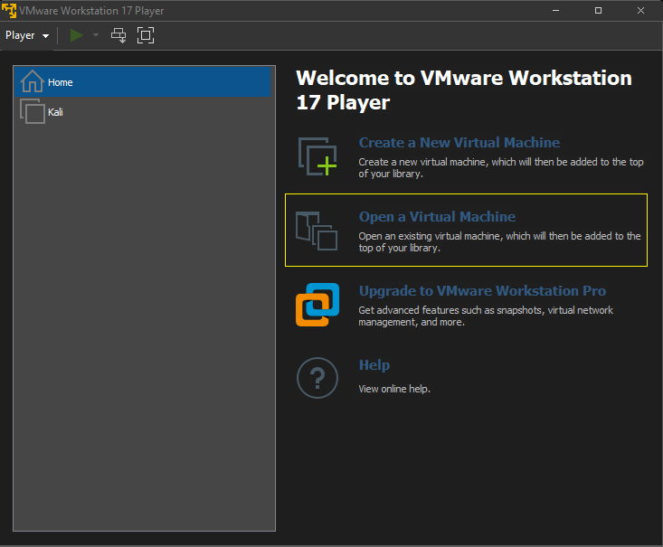
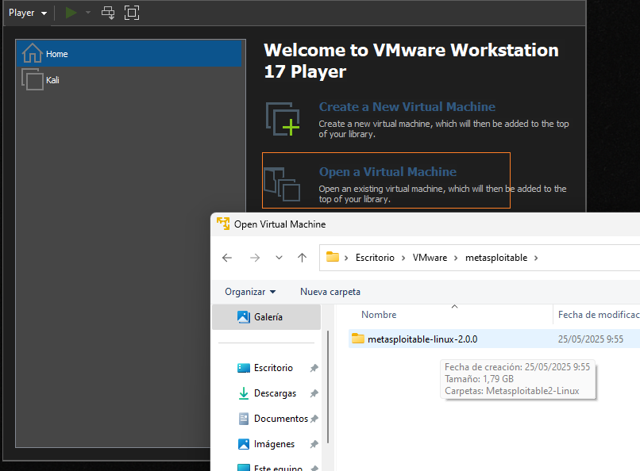
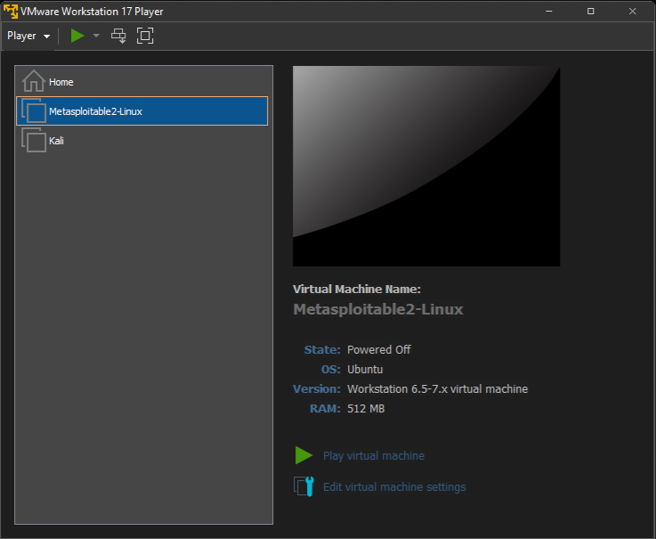
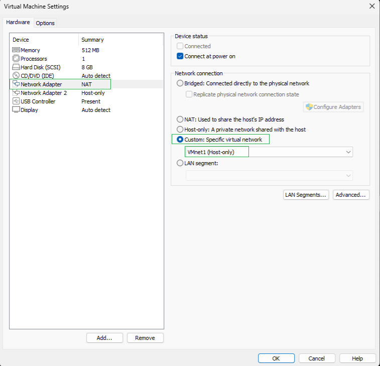

# SUBMÓDULO 2.1 – Configuración de red en VMware (Host-only)

### Objetivo:
Conectar Kali Linux y Metasploitable 2 en una red privada y segura, sin acceso a Internet, para hacer prácticas de pentesting sin riesgo.

### Paso 1: (VMware Player): Cargar Metasploitable por primera vez
Abre VMware Workstation 17 Player.

1. En la pantalla principal, haz clic en “Open a Virtual Machine”.

2. Navega hasta la carpeta donde descomprimiste Metasploitable.

3. Selecciona el archivo Metasploitable.vmx y ábrelo.

4. Se añadirá automáticamente a tu lista de máquinas virtuales a la izquierda (junto a Kali).







### Paso 2 – Cambiar la red de ambas máquinas virtuales
2.1 En Metasploitable 2
- Asegúrate de que la máquina esté apagada.

- En el panel derecho, haz clic en "Edit virtual machine settings".

- Se abrirá una ventana de configuración.

- Haz clic en el adaptador de red (Network Adapter).

- En la parte derecha, selecciona:

"Custom (specific virtual network)"

Y elige de la lista: VMnet1 (host-only network)

Haz clic en OK para guardar los cambios.



2.2 Repetir lo mismo con Kali Linux
Apaga Kali si está encendida.

- Haz clic en "Edit virtual machine settings".

- Selecciona Network Adapter.

Escoge:

"Custom (specific virtual network)"

Y elige: VMnet1

Haz clic en OK.

## 🔁 ¿Qué hemos hecho?
Ahora ambas máquinas comparten una red cerrada tipo Host-only:
```
[Tu Host físico] <--> [VMnet1 (192.168.56.0/24)]
         |                      |
      [Kali]               [Metasploitable]

```
Esta red es local. No tiene acceso a Internet, pero sí permite que las máquinas se comuniquen entre ellas y con el host. Ideal para pentesting.

### ✅ Paso 3 – Iniciar las máquinas y comprobar la conexión
3.1 Arrancar ambas VMs (Kali y Metasploitable)
3.2 Iniciar sesión en Metasploitable:
```
Username: msfadmin
Password: msfadmin
```
### 3.3 Obtener la IP de Metasploitable:
En Metasploitable:
```
ifconfig
```
Busca la interfaz eth0 y apunta su IP (por ejemplo: 192.168.56.102).
### 3.4 Obtener la IP de Kali:
En Kali:
```
ip a
```
Busca la IP de la interfaz conectada a VMnet1 (puede ser eth0, ens33, etc.).
### 3.5 Probar la conexión:
Desde Kali:
```
ping <IP_de_Metasploitable>
```
Desde Metasploitable:
```
ping <IP_de_Kali>
```
✅ Si hay respuesta, ¡la red está funcionando! Ya tienes tu entorno listo para empezar las prácticas de enumeración.

🔗 **Vídeo complementario (sin voz, uso documental):**  
[1 Configuración de red en VMware (Host-only)– Curso básico de Pentesting (Módulo 2)](https://youtu.be/7p_gTAGtPHI)
