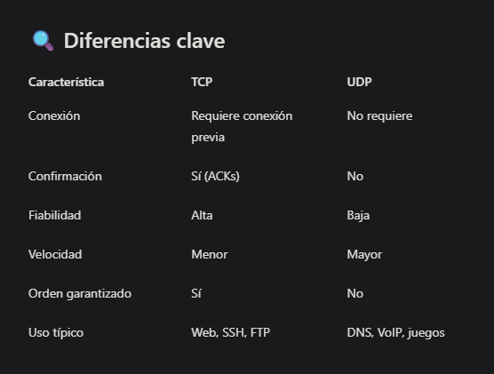

# SUBMÓDULO 2.4 – Protocolos TCP vs UDP

### 🎯 Objetivo
Entender las diferencias esenciales entre TCP y UDP, cómo afectan a la forma de escanear y cómo interpretarlas al hacer análisis de red.
### ¿Qué son los protocolos TCP y UDP?
Son protocolos de transporte. Es decir, definen cómo viajan los datos entre dos dispositivos conectados por red.
```
⚠ No compiten, se complementan. Cada uno sirve a propósitos distintos.
```
### Analogía práctica
- TCP → como enviar una carta certificada con acuse de recibo.

- El receptor confirma que la recibió.

- Si se pierde, se vuelve a enviar.

- Todo llega en orden y completo.

- Ideal para: web, correo, SSH, FTP…

### UDP → como lanzar un panfleto por la ventana.

- No sabes si lo reciben.

- No hay confirmación.

- Es más rápido, pero menos confiable.

- Ideal para: juegos online, DNS, streaming…



### ¿Cómo se detectan?
  Ver puertos TCP:
```
ss -tln
```
Ver puertos UDP:
```
ss -tln
```

Significado de opciones:
- -t → Muestra solo conexiones TCP
- -l → Muestra solo puertos en escucha
- -n → Muestra IPs y puertos en formato numérico (más rápido, sin resolver nombres).


Prueba ambos en Kali y en Metasploitable. Te darás cuenta de que muchos servicios abiertos son TCP… pero también hay algunos UDP que no se ven tan fácilmente.

## EJERCICIO 3 – Comparar servicios locales TCP y UDP
1. En Kali:
```
ss -tlpn
ss -ulpn
```
2. En Metasploitable:
```
netstat -tlpn
netstat -ulpn
```
Anota:

- ¿Qué servicios se ejecutan por TCP?

- ¿Cuáles por UDP?

- ¿Cuál es la IP local y el puerto de cada uno?


🔗 **Vídeo complementario (sin voz, uso documental):**  
[3 – Comparar servicios locales TCP y UDP](https://youtu.be/16PRFZgeLRA)

## EJERCICIO 4 – Ver la diferencia con nmap
1. Desde Kali, escanea Metasploitable por TCP:
```
nmap -sS 192.168.106.129 - [o la IP de tu metasploitable]
```
2. Escanea ahora por UDP (esto tarda más):
```
sudo nmap -sU 192.168.106.129 - [o la IP de tu metasploitable]
```
### Analiza:

- ¿Qué puertos responde por TCP?

- ¿Cuáles aparecen abiertos por UDP?

- ¿Hay alguno que no se muestra en los comandos locales?

🔗 **Vídeo complementario**  
[4 – Comparar servicios locales TCP y UDP](https://youtu.be/yp4dA1f2w4U)
