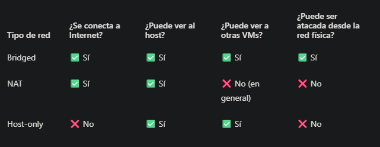

# 2.6 – Tipos de red en entornos virtuales
### 🎯 Objetivo
Comprender las diferencias entre los tipos de conexión de red que ofrece VMware y cómo afectan a la práctica de pentesting.

### ¿Por qué importa esto?
Cuando trabajas con máquinas virtuales, el tipo de red determina si puedes comunicarte con el host, con Internet, o entre máquinas, y también si puedes atacar servicios reales o solo simular un entorno cerrado.

## Tipos de red en VMware (y VirtualBox)

### 1. Bridged (puenteada)
- Conexión directa a tu red física local

- Tu VM obtiene una IP de la misma red que tu router

- Se comporta como un “PC más” en la red

✅ Pros:

- Puedes atacar otros dispositivos reales de tu red (con ética)

- Ideal para laboratorios avanzados

❌ Contras:

- No es segura si no sabes lo que haces

- Puedes comprometer tu red real por error

### 2. NAT (Network Address Translation)
- Tu VM comparte la conexión de red del host

- Sale a Internet a través del host, pero no recibe conexiones entrantes

- El host actúa como “intermediario”

✅ Pros:

- Puedes actualizar Kali, instalar herramientas, etc.

- Más seguro que Bridged

❌ Contras:

- No puedes recibir conexiones entrantes desde otra VM NAT o desde el host

- Dificulta algunas pruebas de red

### 3. Host-only
- Crea una red privada entre el host y las VMs

- Sin acceso a Internet

- Las VMs pueden comunicarse entre ellas y con el host

✅ Pros:

- Ideal para laboratorios cerrados

- Lo que estamos usando con Kali + Metasploitable

- ❌ Contras:

- No tiene acceso a Internet (pero en pentesting local no lo necesitas)

### Comparativa rápida

## Resumen
### Tipos de red en entornos virtuales

- **Bridged**: conexión directa, máxima exposición. Útil para pruebas realistas.
- **NAT**: acceso a Internet sin exposición directa. Útil para actualizar paquetes.
- **Host-only**: red cerrada entre VMs y el host. Ideal para pentesting seguro y controlado.

**Usado en el laboratorio:** Host-only sobre VMnet1
