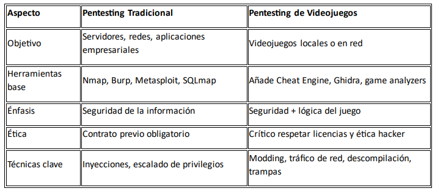

# MÓDULO 0 — Introducción y Preparación del Entorno
## 🎯 Objetivo del módulo
Establecer una base sólida antes de realizar cualquier práctica: entender qué es el pentesting de videojuegos, por qué se hace, en qué se diferencia del pentesting tradicional y cómo preparar un laboratorio seguro, ético y funcional sobre Kali Linux

## 0.1 — ¿Qué es el Pentesting de Videojuegos?
Pentesting (penetration testing) es una disciplina de la ciberseguridad que busca encontrar vulnerabilidades en sistemas informáticos de forma controlada y ética.
El pentesting de videojuegos se enfoca específicamente en detectar, analizar y entender debilidades de seguridad en juegos digitales, ya sean locales, online o híbridos.

## 🎮 ¿Por qué los videojuegos?
Porque un videojuego moderno es un ecosistema completo:
-	Tiene lógica cliente (código del juego)
-	Puede tener lógica servidor (infraestructura remota)
-	Utiliza redes, bases de datos, autenticación
-	A menudo gestiona dinero real o inventado (skins, puntos, micropagos)
-	Interactúa con millones de usuarios (chat, matchmaking, APIs)

## 💥 Ejemplos de vectores de ataque:
-	Modificación del cliente para hacer trampas
-	Sniffing de tráfico para interceptar datos o duplicar objetos
-	Abuso de errores de lógica (ej. compras gratuitas)
-	Bypass de validaciones (movimientos, colisiones, físicas)
-	Reversing para entender cómo funciona internamente

---

## 0.2 — Diferencias con el Pentesting Tradicional

👉 No buscamos romper juegos ni hacer trampas online: queremos comprender, documentar y aprender cómo se estructura y defiende un sistema lúdico.

---

## 0.3 — Entorno de Trabajo: Kali Linux

## ¿Por qué Kali?

Es el sistema operativo estándar de hacking ético. Trae de serie:
-	Ghidra (ingeniería inversa)
-	Wireshark (análisis de tráfico)
-	Burp Suite Community
-	nmap, netcat, tcpdump, scapy
-	Python preinstalado
Opciones de instalación:
-	🖥️ VirtualBox/VMware: ideal para mantenerlo aislado
-	💾 Instalación nativa: si quieres rendimiento completo
-	🪟 WSL 2 (subsistema Linux en Windows): alternativa ligera si no puedes usar máquina virtual
📌 En nuestro caso usaremos preferentemente VirtualBox o VMware con snapshots frecuentes.

---

## 0.4 — Herramientas Base del Lab

### Aquí está tu arsenal inicial. Todas están disponibles en Kali:

### 🛠️ Red y tráfico
-	Wireshark → analizar paquetes
-	netcat → conexiones básicas TCP/UDP
-	tcpdump → tráfico desde consola
-	mitmproxy → intercepción avanzada
-	Burp Suite → interceptar peticiones web
### 🧠 Reversing y binarios
-	Ghidra → análisis estático y dinámico
-	x64dbg (en Windows) → debug en binarios PE
-	Cheat Engine → memoria y lógica interna
-	strings, objdump, ltrace → consola
### 🧪 Programación y scripting
-	Python 3, con:
  -	requests
  -	socket
  -	scapy
-	gcc / g++ para pruebas en C/C++
### ⚙️ Más adelante se incluirán herramientas avanzadas como:
-	IDA Free
-	Frida (hooking)
-	Radare2 (para los que quieran ir más allá)

