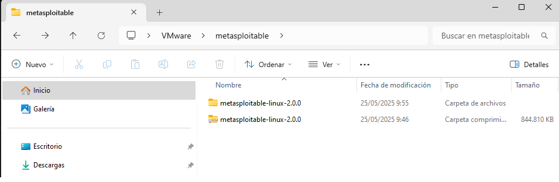

# MÓDULO 2.0 – Configuración del entorno con VMware y Metasploitable

### Objetivo global:
Construir un laboratorio privado de pentesting con Kali Linux (atacante) y Metasploitable 2 (víctima), totalmente funcional y documentado. Aprender a descubrir y enumerar redes y servicios desde cero.

## Estructura del Módulo 2.1
(esto es lo que vamos a ir desplegando)

### SUBMÓDULO 1 – Preparación del entorno (VMware)
Objetivo: Tener ambas máquinas virtuales operativas y comunicándose por red.

1.1 Descarga e instalación de Metasploitable 2
Descargar: https://sourceforge.net/projects/metasploitable/

El archivo se descarga como .zip, descomprimirlo y abrir el .vmx directamente en VMware.

Nota: Metasploitable 2 no requiere instalación, ya viene preconfigurado con Ubuntu 8.04 lleno de vulnerabilidades para practicar.
Usuario: msfadmin – Contraseña: msfadmin

### 1.2 Configuración de red en VMware
Vamos a usar Host-only network:

Abrir Virtual Network Editor de VMware.

Crear o verificar la red VMnet1 (tipo Host-only).

Configurar ambos sistemas (Kali y Metasploitable) para que usen VMnet1 como adaptador de red.

Nota: El tipo "Host-only" crea una red entre tu Kali y Metasploitable, sin acceso a internet. Ideal para pentesting sin riesgos.

### 1.3 Comprobación de conectividad
En Kali:
```
ip a     # ver IP asignada a la interfaz vmnet1
ping <IP de Metasploitable>  # ej. ping 192.168.56.102
```
En Metasploitable:
```
ifconfig     # ver IP de su interfaz (suele ser eth0)
ping <IP de Kali>
```
NOTA de aprendizaje:
Si ip a o ifconfig no están disponibles:
ip a ya está incluido en Kali. En Metasploitable puedes usar ifconfig, pero si no estuviera, se instala con net-tools:
```
sudo apt-get install net-tools
```

### SUBMÓDULO 2 – Fundamentos de redes para pentesters (teoría aplicada)
Antes de enumerar, tienes que comprender la red que estás analizando.

Contenido:

- Qué es una IP

- Qué es una máscara de subred

- Qué es un puerto

- Qué es TCP vs UDP

- Qué es un servicio expuesto

- Diferencia entre red externa, interna, NAT, Host-only

- Qué es la enumeración

### SUBMÓDULO 3 – Enumeración básica de red (práctica guiada)
Ejercicios paso a paso

- ip a – identificar nuestra IP y red

- arp-scan – escaneo de vecinos

- ping sweep – test de actividad de hosts

- nmap -sn – descubrimiento sin escanear puertos

- nmap -sS – escaneo de puertos TCP (SYN)

- nmap -sU – escaneo de puertos UDP

- nmap -A – escaneo agresivo y fingerprinting

### SUBMÓDULO 4 – Introducción a Linux y terminal para pentesting

- Cómo navegar por carpetas (cd, ls, pwd)

- Cómo usar sudo, instalar programas, leer logs

- Cómo usar grep, cut, head, etc. para filtrar salidas

# ¿Cómo empezamos ahora?
Paso 1: ¿Ya tienes descargada y descomprimida Metasploitable?
Si no, te dejo el enlace y lo haces ahora:
https://sourceforge.net/projects/metasploitable/

Cuando la tengas:

- Descomprime el .zip.

- Dentro verás un archivo llamado algo así como Metasploitable.vmx.

- Haz doble clic sobre ese .vmx o ábrelo desde VMware Workstation (o Player) para añadir la VM a tu lista.

- No hace falta instalar nada dentro: ya viene preinstalada con Ubuntu 8.04 + servicios vulnerables.



