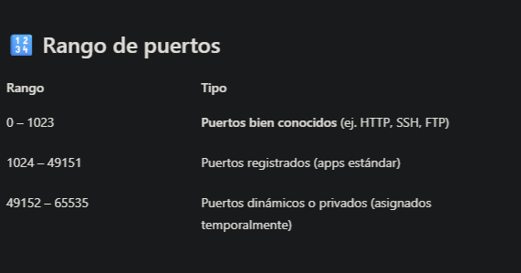
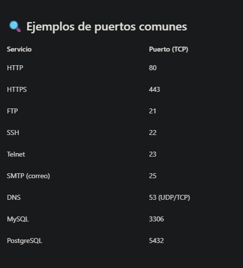

# Submódulo 2.3 - Puertos y servicios
### 🎯 Objetivo
Comprender qué son los puertos, qué papel juegan en las comunicaciones de red y cómo los usan los servicios para permitir conexiones.

### ¿Qué es un puerto?
Un puerto es como una puerta lógica numerada en un dispositivo.
Cada puerto permite que una aplicación o servicio escuche y envíe datos.

```
Analogía:
Piensa en un edificio con una sola dirección postal (la IP), pero con cientos de timbres (los puertos).
Cada timbre conecta con un departamento distinto
```



### ¿Cómo ver los puertos abiertos en tu sistema?
En Kali:
```
ss -tuln
```
Significado de opciones:

- -t → Muestra solo conexiones TCP

- -u → Muestra solo conexiones UDP

- -l → Muestra solo puertos en escucha

- -n → Muestra IPs y puertos en formato numérico (más rápido, sin resolver nombres).

### ¿Qué es ss?
El comando ss significa socket statistics.

Es una herramienta de red que muestra todas las conexiones abiertas y puertos en uso en tu sistema.
### Qué hace exactamente?
ss permite ver:

- Qué servicios están escuchando (LISTEN)

- Qué puertos están abiertos

- Qué conexiones están establecidas

- Qué procesos usan cada puerto (con opciones avanzadas)

  ## Ejecicio 2 
 1. En Kali, ejecuta:
```
ss -tuln
```
2.  Observa qué puertos están escuchando (columnas Local Address:Port).
3. En Metasploitable, haz lo mismo:

```
netstat -tuln
```
Deberías ver montones de servicios inseguros abiertos. Eso es justo lo que vamos a aprender a identificar en el módulo 3.

### Cómo se relacionan IP + Puerto?
Una conexión completa se identifica por esta estructura:
```
<IP>:<Puerto>
```
Ejemplo.
```
192.168.106.129:21  →  FTP en Metasploitable
192.168.106.129:22  →  SSH en Metasploitable
```


🔗 **Vídeo complementario (sin voz, uso documental):**  
[2 – ¿Cómo ver los puertos abiertos en tu sistema? Curso básico de Pentesting (Módulo 2)](https://youtu.be/aB9vNybfqG4)