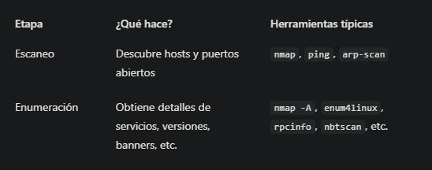

# 2.5 – ¿Qué es la enumeración?

### 🎯 Objetivo
Comprender qué significa “enumerar” en ciberseguridad, cómo se diferencia de escanear, y por qué es el paso donde más información útil y explotable se consigue.

### ¿Qué es la enumeración?
Enumerar es el proceso de extraer información detallada de un sistema después de haberlo identificado como activo y accesible.
###  Diferencia entre escaneo y enumeración


### ¿Qué cosas se pueden enumerar?
- Versiones de servicios (Apache, SSH, etc.)

- Comparticiones de red (Samba/SMB)

- Usuarios del sistema

- Nombres de máquina

- Dominios de red

- Archivos compartidos o permisos mal configurados

- Banners que revelan software antiguo

## EJERCICIO – Enumeración básica con nmap
Desde Kali, ejecuta:
```
nmap -A 192.168.106.129
```
## ¿Qué hace la opción `-A` en `nmap`?

El flag `-A` activa técnicas avanzadas de enumeración:

- **Detección de sistema operativo**: identifica si el host usa Linux, Windows, etc.
- **Detección de versiones**: detecta el nombre y versión del software en los puertos abiertos.
- **Traceroute**: muestra los saltos de red hasta el objetivo.
- **Script Scanning (NSE)**: ejecuta scripts automatizados que detectan vulnerabilidades o configuraciones inseguras.

Este tipo de escaneo proporciona una visión detallada del sistema objetivo, y debe utilizarse con criterio para no generar ruido excesivo o alertas.


```
nmap -A 192.168.106.129 -oN enumeracion_metasploitable.txt
```
### Consejos para enumerar bien
- Siempre después del escaneo inicial.

- Usa escaneos más profundos solo contra objetivos concretos.

- Guarda siempre la salida para analizarla después.

- Presta atención a versiones de software antiguas (son carne de CVE).

